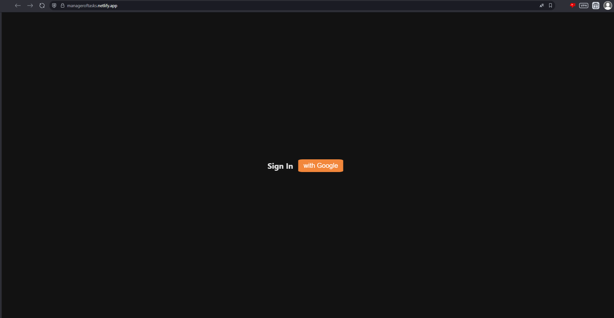
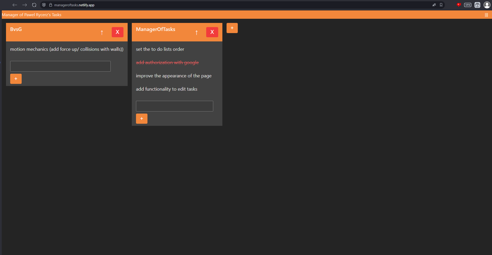

# Manager Of Tasks

A web application that allows users to manage their tasks in a simple and intuitive way.

This project is a **showcase version** – sensitive configuration has been removed.

---

## 🚀 Features
- User authentication (login / logout)
- Users can see only their own tasks
- Adding, editing (mark as done), and removing tasks
- Application remembers logged-in user on the device

---

## 🛠️ Tech Stack
- React.js
- JavaScript
- REST API
- Firebase Authentication
- Firebase Firestore

---

## 🏗️ Architecture Overview
- Firebase Authentication is used for user authentication and session handling
- Firestore is used as the main database for storing tasks

---

## 🧠 What I Implemented
- Authentication flow using Firebase Authentication
- CRUD operations on tasks using Firestore
- State management with React hooks
- Integration with REST-like Firebase APIs
- Basic access control (users can access only their own data)

---

## 📸 Screenshots



---

## ⚙️ How to Run the Application

1. Install dependencies:
   ```bash
   npm install
   ```
## Live demo
https://manageroftasks.netlify.app

